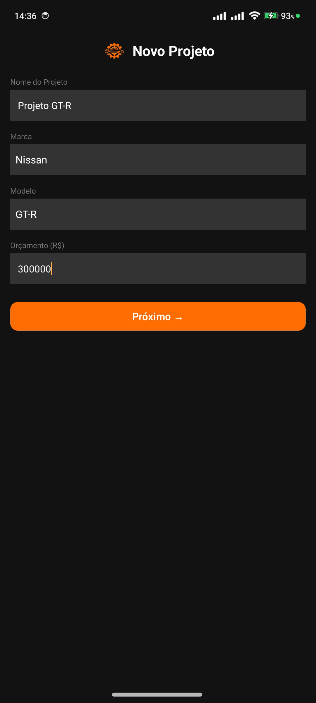
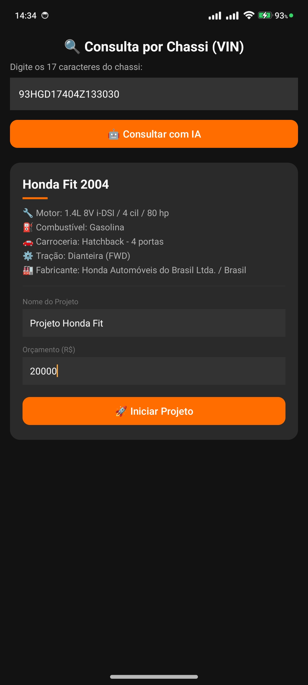
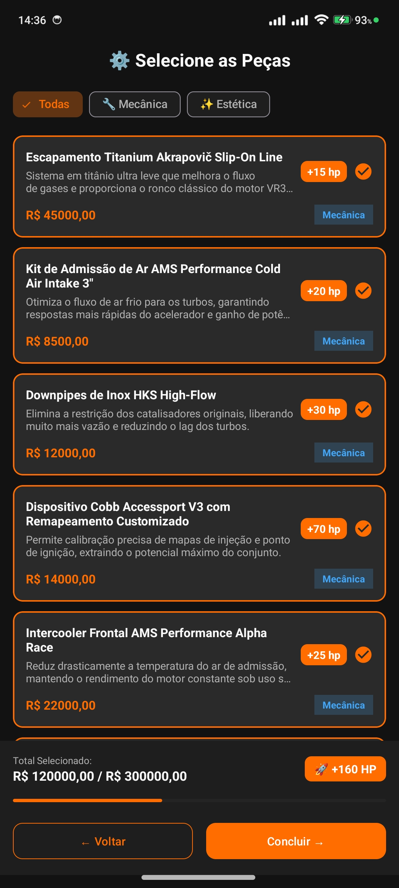
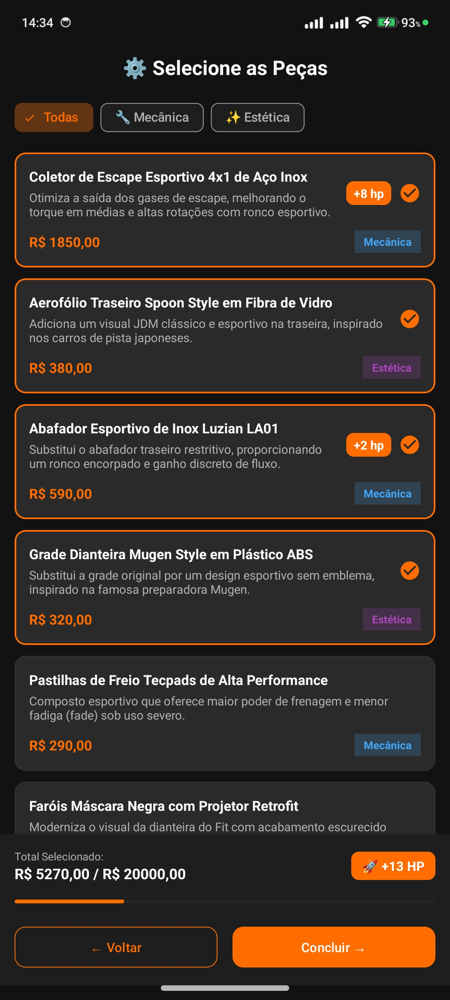
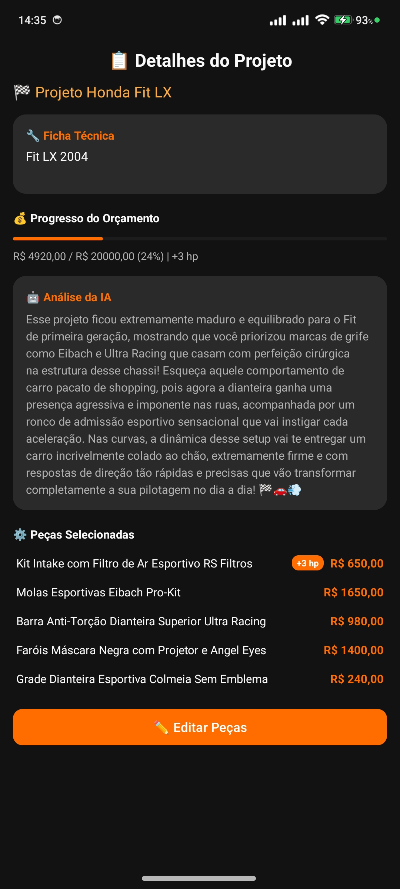

# ⚙️ GearUp - O Seu Garagem Virtual & Tuning Studio

Bem-vindo ao **GearUp**, o aplicativo definitivo para entusiastas automotivos que desejam planejar, gerenciar e tunar seus projetos de carros dos sonhos! 

O GearUp não é apenas um bloco de notas; é um estúdio de modificação completo, alimentado por inteligência artificial, projetado para te ajudar a transformar ideias em projetos concretos sem estourar o orçamento.

---

## 🏎️ Como Funciona? (O Fluxo do App)

O GearUp foi pensado para ser incrivelmente intuitivo. Abaixo, você confere o passo a passo completo da experiência do usuário:

### 1. 🏠 O Dashboard: A Sua Garagem
Logo ao abrir o aplicativo, você é recebido pelo seu **Dashboard** (Meus Projetos). Aqui você encontra todos os seus projetos de tunagem atuais listados.
A partir do Dashboard você tem as principais ferramentas na ponta dos dedos: pode visualizar os custos de cada projeto ativo, buscar por oficinas próximas ou iniciar um novo projeto através da nossa Consulta por Chassi.

### 2. 📝 Criando um Novo Projeto
Você tem duas formas fantásticas de iniciar o seu projeto:

**A. Inserção Manual (Novo Projeto):**
Defina o nome da sua build, a marca, o modelo e o seu limite de gastos (orçamento). O app vai te ajudar a manter o controle financeiro do seu projeto, seja ele um *Projeto GT-R* de 300 mil reais ou um carro para o dia a dia!

**B. Consulta Inteligente (VIN):**
Está de olho em um carro específico na vida real? Basta inserir o chassi do carro (VIN), e a nossa IA fará uma varredura para extrair e preencher automaticamente o motor, ano, tração e as especificações de fábrica exatas do veículo!

### 3. 🛠️ O Tuning Studio: Escolhendo Peças
Após criar o projeto, a diversão começa! Você é levado para a loja virtual de peças personalizadas para o seu modelo.
- **Categorias Inteligentes**: Alterne rapidamente entre peças de **Mecânica** (performance) e **Estética** (visual).
- **Catálogo Dinâmico por Veículo**: O banco de dados se adapta perfeitamente ao calibre do seu projeto. Nas imagens abaixo, você confere como o aplicativo oferece um *Escapamento de Titânio Akrapovič* para um **Nissan GT-R** e um *Coletor Esportivo Inox* focado em custo-benefício para um **Honda Fit**.
- **Carrinho e Desempenho**: Ao selecionar as modificações, a barra inferior soma automaticamente o Custo e o Ganho de HP (cavalos de potência) do seu carro em tempo real.
- **Proteção de Orçamento**: A barra de progresso te mostra exatamente o quanto da sua verba já foi comprometida!

### 4. 📊 Relatório Final e Análise da IA
Na página de Detalhes do Projeto, você tem a visão de cima sobre a sua obra de arte:
- **Ficha Técnica Real**: Mostra o nome do projeto e os detalhes originais do modelo.
- **Peças Instaladas**: Uma lista compacta mostrando onde o dinheiro foi gasto.
- **Análise da Inteligência Artificial**: O GearUp age como o seu **Mecânico Chefe Virtual**. Ele analisa todas as peças que você selecionou e te entrega um parecer técnico e visceral sobre como o seu carro vai se comportar na pista, curvas e nas ruas!

---

## 🚀 Resumo das Funcionalidades

- **Gerenciamento de Múltiplos Projetos**: Tenha dezenas de builds salvas na sua garagem.
- **Peças Baseadas em Banco de Dados**: A nuvem puxa peças compatíveis focadas em estética e mecânica específicas para o calibre do seu carro.
- **Cálculo em Tempo Real**: Veja na hora o quanto cada peça aumenta no seu orçamento e no seu desempenho (+HP).
- **Tema Automotivo Dark**: Interface desenhada com fundo preto esportivo e destaque em "Racing Orange", remetendo aos painéis de superesportivos.
- **Inteligência Artificial Nativa**: Consulta de VINs misteriosos e feedbacks reais da sua montagem via AI.

---
*GearUp - Construa seu projeto perfeito antes de sujar as mãos de graxa.*
